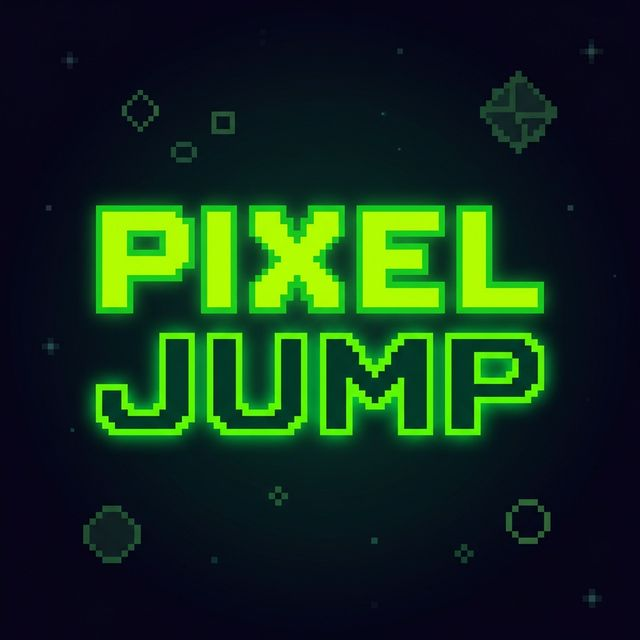

<p align="center">
  
</p>


<div align="center">

# PIXEL JUMP 🎮

**8-bit Pixel Art Vertical Platformer - Telegram Mini Game**


[](LICENSE)
[]()

</div>

## 🎯 Features

- **8-bit Pixel Art Style** - Authentic NES/GameBoy aesthetic
- **Doodle Jump Mechanics** - Vertical platformer with auto-jump
- **3 Platform Types** - Normal, Breaking, and Moving platforms
- **Procedural Audio** - 8-bit sound effects generated with Web Audio API
- **Multiple Controls** - Keyboard, Touch, and Accelerometer support
- **Telegram Integration** - User data, haptic feedback, score sharing
- **Score Persistence** - Local high scores with localStorage
- **Skins System** - Unlockable character colors

## 🚀 Quick Start

### Local Development

```bash
npm install
npm start
```

Game will be available at `http://localhost:3000`

### Firebase Deployment

```bash
# Login to Firebase
firebase login

# Initialize project (if not done)
firebase init

# Deploy
npm run deploy
```

## 🎮 Controls

- **Keyboard**: Arrow Keys or A/D
- **Touch**: Tap left/right screen halves
- **Tilt**: Enable in settings for accelerometer control

## 📁 Project Structure

```
/
├── index.html          # Main HTML
├── style.css           # 8-bit pixel art styles
├── main.js             # Game entry point & UI
├── game-engine.js      # Core platformer mechanics
├── audio.js            # 8-bit sound generation
├── settings-skins.js   # Settings & skins functionality
├── telegram.js         # Telegram Mini App integration
├── firebase-config.js  # Firebase backend
└── firebase.json       # Firebase hosting config
```

## 🎨 Tech Stack

- **Frontend**: Vanilla JavaScript (ES6 Modules)
- **Rendering**: HTML5 Canvas
- **Audio**: Web Audio API
- **Backend**: Firebase (Firestore, Auth, Hosting)
- **Integration**: Telegram Web App SDK

## 📊 Game Mechanics

- **Gravity**: 0.5 px/frame²
- **Jump Force**: -12 px/frame
- **Platform Gap**: 80px (increases with difficulty)
- **Score**: Height / 10
- **Combo**: 3+ consecutive jumps

## 🔧 Configuration

Edit `firebase-config.js` to add your Firebase credentials:

```javascript
const firebaseConfig = {
  apiKey: "YOUR_API_KEY",
  authDomain: "YOUR_AUTH_DOMAIN",
  projectId: "YOUR_PROJECT_ID",
  // ...
};
```

## 📝 License

Apache License 2.0 - Feel free to use and modify!

## 🎮 Play Now

https://t.me/pixel_jump_bot

---

Made with ❤️ using 8-bit pixel art Pixel-Jump
# Pixel-Jump
